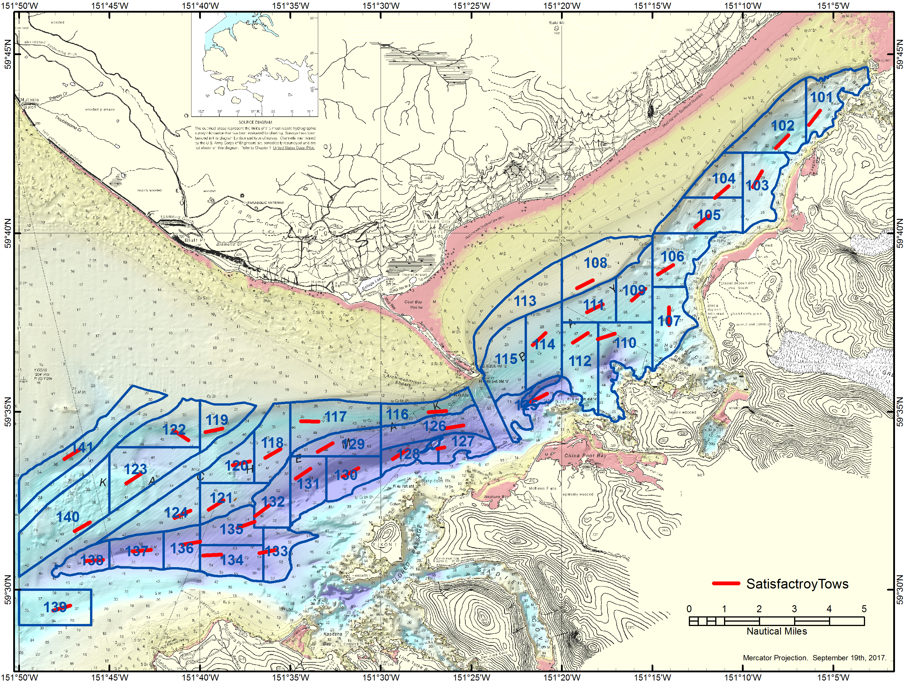
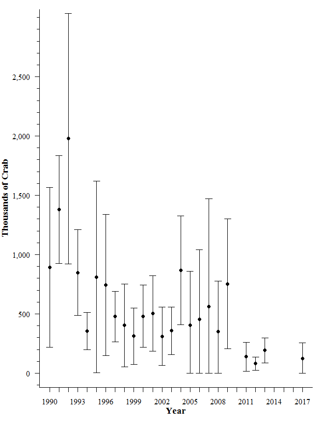
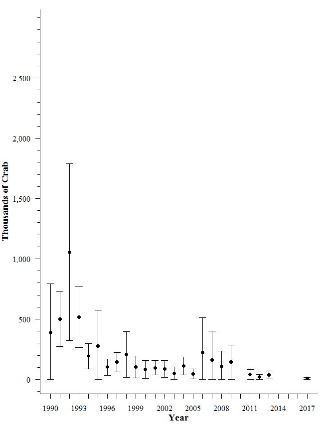

```{r, echo=FALSE, message=FALSE, warning=F}
library(knitr)
library(xtable)
library(tidyverse)
options(scipen=9999) # remove scientific notation
knitr::opts_chunk$set(echo = FALSE, message=F, warning=F)
```

The 2017 Kachemak Bay large-mesh trawl survey was completed between August 29th and September 6th.  A total of 39 successful 0.5 nmi tows were completed, including 38 core stations and 1 ancillary station (station 139). 

The recruit class size definitions for male Tanner crab in Cook Inlet were revised in 2017, coinciding with a reduction in the legal size limit from 140 mm (5.5 in) to 114 mm (4.5 in) (Table 1).  The 2017 definitions are intended to be the focus here and in the future.  However, the entire time series of survey data (1990 to 2017) were analyzed using both sets of size limits herein, for historical comparative purposes.

The 2017 survey captured 1,481 male and 1,350 female Tanner crab.  Of these males, 137 were legal using the 2017 revised legal limit and 8 were legal according to the historical legal definition.  Mean legal male CPUE using the 2017 size limit was 10.12 crab/nmi (CV = 3.22) and ranged from 0 to 186.
The estimated abundance of legal males using the 2017 legal size (>114mm) was 124,965 crabs (95% CI = 132,244) (Table 2; Figure 2).

When the revised size limits were retroactively applied to the historical survey data, the 2017 abundance estimate was the 2nd lowest, surpassing only 2012. When analyzed using the historical legal size (>140mm) the 2017 survey produced the lowest abundance estimate on record, less than half of the 2012 estimate (Table 3; Figure 3).    
    

\newpage



```{r, results='asis', echo=F}
read.csv("../data/ClassLUT_T04931_2017.csv") %>%
 select('Recruit category' = Recruit.category, 'pre-2017'= pre.2017, '2017' = X2017) -> LUT
  print(xtable(LUT, caption = 'Male Tanner crab carapace width (mm) by recruit category for the Southern Distric trawl surveys.'),
        comment=FALSE, include.rownames = FALSE , caption.placement = "top")
```  

```{r, results='asis', echo=F}
read.csv("../output/931PopMales_Main_17.csv") %>%
select(Year = YEAR, Tows = n, 'Pre-4 (<66mm)' = P4, 'Pre-3 (66-79mm)' = P3, 'Pre-2 (80-95mm)' = P2, 'Pre-1 (96-113mm)' = P1,
                  'Legal (>114mm)'= LM_P_, 'Legal CI'= LM_P_CI_, 'Total' = TM_P_, 'Total CI'= TM_P_CI_ ) %>%
mutate (Year = as.factor(Year)) %>%
mutate_if(is.numeric,funs(prettyNum(., big.mark=","))) -> LM17
print(xtable(LM17,
            caption="Male Tanner crab abundance estimates using the 2017 size class revisions from trawl surveys in the Southern District, 1990-2017.
              No survey was conducted in 2010 and 2014-2016",
            align = "ccccccccccc"),
      floating.environment="sidewaystable", comment=FALSE, include.rownames = FALSE , caption.placement = "top")

```   


```{r, results='asis', echo=F}
read.csv("../output/931PopMales_Main_old.csv") %>%
select(Year = YEAR, Tows = n, 'Pre-4 (<70mm)' = P4, 'Pre-3 (70-91mm)' = P3, 'Pre-2 (92-114mm)' = P2, 'Pre-1 (115-139mm)' = P1,
                  'Legal (>140mm)'= LM_P_, 'Legal CI'= LM_P_CI_, 'Total' = TM_P_, 'Total CI'= TM_P_CI_ ) %>%
mutate (Year = as.factor(Year)) %>%
mutate_if(is.numeric,funs(prettyNum(., big.mark=","))) -> LM17
print(xtable(LM17,
            caption="Male Tanner crab abundance estimates using the pre-2017 size class definitions from trawl surveys in the Southern District, 1990-2017.
              No survey was conducted in 2010 and 2014-2016",
            align = "ccccccccccc"),
      floating.environment="sidewaystable", comment=FALSE, include.rownames = FALSE , caption.placement = "top")


```   

\newpage




